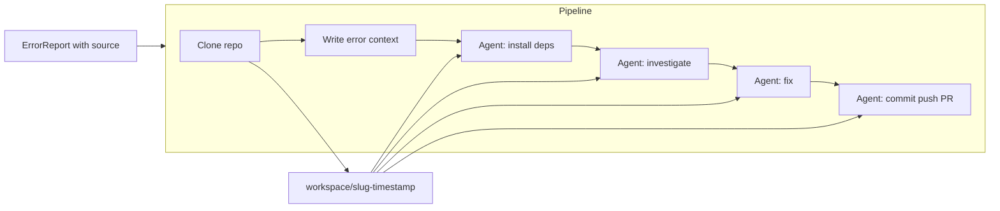

# Error Handler Pipeline

## Goal

Refactor [src/utils/errorHandler.ts](src/utils/errorHandler.ts) from a single `handleError` that spawns one agent into a **pipeline** that:

1. Clones the repository (git CLI) into `workspace/<source-slug>-<timestamp>/`
2. Writes error context into the clone for the agent
3. Runs agent steps sequentially from inside the clone: install deps → investigate → fix → commit/push/PR

Agent is always run with **cwd = clone path** so it sees only the cloned repo (and we can add `workspace/` to [.gitignore](.gitignore)).

---

## Behavior and data flow

- **When pipeline runs:** Only when `source` is present (e.g. POST /error with `source` in body). When `source` is missing (e.g. Express middleware error), keep current fallback: log error, optionally write `error.log` at project root, and either skip pipeline or use a single agent run from project root (to be decided; recommend “skip pipeline, just log”).
- **Clone location:** `workspace/<source-slug>-<timestamp>/` under project root. **Slug:** derive from `source` (e.g. sanitize URL/path: replace non-alphanumeric with `-`, collapse dashes; or use last path segment of URL). **Timestamp:** e.g. `Date.now()` or ISO string without colons so the path is unique and fs-safe.
- **Error context:** Before any agent step, write a file inside the clone (e.g. `error-context.md` or `.self-healing/error-context.md`) containing message, stack, timestamp, and metadata so the agent can read it. Use a path that is not in the clone’s `.gitignore` by default.

---

## Implementation outline

### 1. Pipeline entry and `source` handling

- **New pipeline entry:** e.g. `runPipeline(report: ErrorReport): void` (or `Promise<void>` if steps are async). Call it from POST /error when `result.data.source` is present; pass full `result.data` (message, stack, source, timestamp, metadata).
- **When `source` is missing:** In POST /error, do not call the pipeline; either return 400 with a message like “source is required for self-healing pipeline” or keep current single `handleError(error)` behavior (log + write error.log + one agent run from project root). Recommend: require `source` for pipeline and return 400 if missing; in Express error middleware, call existing `handleError` (no pipeline) since we don’t have a report with `source`.
- **Backward compatibility:** Keep `handleError(error: Error)` for middleware and for callers that only have an `Error`; it will not run the pipeline (no clone, no multi-step agent). Optionally add an overload or a second function that accepts `ErrorReport` and runs the pipeline when `source` is set.

### 2. Clone step (git CLI)

- Resolve workspace root: e.g. `path.join(process.cwd(), 'workspace')`. Ensure `workspace` exists (`mkdirSync(..., { recursive: true })`).
- Compute clone dir: `workspace/<source-slug>-<timestamp>`.
- Run `git clone <source> <cloneDir>` via `spawnSync` or `child_process.spawn` + wait for exit (pipeline is sequential). Use a timeout and non-zero exit code handling; on failure, log and stop pipeline.

### 3. Write error context into clone

- After clone, write one file inside the clone (e.g. `path.join(cloneDir, 'error-context.md')` or `.self-healing/error-context.md`) with: message, stack (if any), timestamp, metadata (if any). Format: human-readable (e.g. markdown) so agent prompts can say “see error-context.md in this repo”.

### 4. Agent steps (sequential, cwd = clone)

- **Steps:** install dependencies → investigate error → fix error → commit + push + create PR. Each step runs the same `agent` CLI with a **step-specific prompt** and **cwd = clone path**.
- **Invocation:** Reuse current pattern: `spawn('agent', ['-f', '-p', '<step prompt>'], { cwd: cloneDir, stdio: 'inherit', shell: true })`. For sequential execution, **wait for each step to finish** (e.g. use `spawnSync` or wrap `spawn` in a Promise that resolves on `close`). If a step exits non-zero, stop the pipeline and log (no need to delete the clone; leave it for debugging).
- **Prompts (concise):**
  - Install deps: e.g. “Install project dependencies (npm install, yarn, pnpm, etc.) so the project is ready to run.”
  - Investigate: e.g. “Read error-context.md in this repo. Investigate the error and identify the cause.”
  - Fix: e.g. “Using your investigation, fix the error. Apply code changes in this repo.”
  - Commit/push/PR: e.g. “Create a new branch, commit your changes, push the branch, and open a pull request.”
- **Detached vs attached:** Current code uses `detached: true` and `unref()` so the server doesn’t wait. For the pipeline, either: (a) run the pipeline in the same process but asynchronously (e.g. `void runPipeline(report)` so the HTTP response is still 202 immediately), or (b) spawn a single child process that runs the whole pipeline and unref it. Option (a) is simpler and keeps pipeline logic in one place; recommend (a) with `void runPipeline(report)` so POST /error still returns 202 quickly.

### 5. Files to touch

| File                                                   | Changes                                                                                                                                                                                                                         |
| ------------------------------------------------------ | ------------------------------------------------------------------------------------------------------------------------------------------------------------------------------------------------------------------------------- |
| [src/utils/errorHandler.ts](src/utils/errorHandler.ts) | Add pipeline: slug + clone path helpers, clone step (git), write error-context, sequential agent steps with cwd; keep `handleError(error)` for non-pipeline use; add `runPipeline(report: ErrorReport)` that requires `source`. |
| [src/index.ts](src/index.ts)                           | POST /error: pass full `result.data`; if `source` present call `runPipeline(result.data)`, else return 400 or call `handleError(error)` (decide and document). Middleware: keep `handleError(err)`.                             |
| [.gitignore](.gitignore)                               | Add `workspace/` so cloned repos are not committed.                                                                                                                                                                             |

### 6. Edge cases

- **Invalid or private `source`:** Clone can fail (e.g. 404, auth). Log error and stop pipeline; no need to delete partial clone.
- **Agent not installed:** Spawn will fail; same as above.
- **Concurrent reports:** Two reports with same slug and same second could theoretically get the same path; include timestamp with enough resolution (e.g. `Date.now()`) to make collision negligible.

---

## Optional follow-ups (out of scope for this plan)

- Make agent command configurable (e.g. env `AGENT_CMD`).
- Make prompts configurable (e.g. from a config file or env).
- Add retries or timeouts per step.
- Add a simple log or status file under the clone (e.g. which step failed) for debugging.

