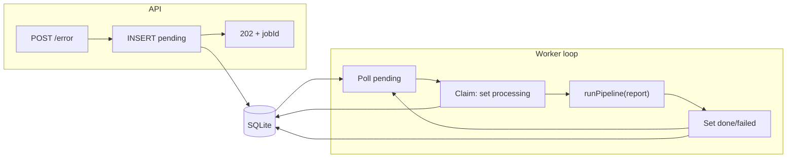

# SQLite Error Queue — Implementation Plan

## Locked-in design

- **POST /error:** Validate body (existing [errorReportSchema](src/schemas/errorReport.ts) + require `source`). Insert one row into SQLite with status `pending` and report as JSON. Return **202** with `{ accepted: true, jobId }`. No pipeline call in the request path.
- **Single in-process worker:** After the app starts, a background loop polls the queue for `pending` (and on startup reclaims any stale `processing`). Claims one row (set to `processing`), runs [runPipeline(report)](src/utils/errorHandler.ts), sets row to `done` or `failed`, then fetches next `pending` or waits (poll interval ~1–2 s). Only one job runs at a time.
- **Durability:** All accepted work lives in SQLite; crash/restart does not lose pending jobs.

---

## 1. SQLite queue schema and module

- **DB file:** Single file under project root (e.g. `data/queue.db` or `queue.db`). Add `data/` or `*.db` to [.gitignore](.gitignore) if applicable.
- **Table (e.g. `error_jobs`):**
  - `id` INTEGER PRIMARY KEY AUTOINCREMENT (or use a UUID for `jobId` in response; either is fine).
  - `payload` TEXT NOT NULL (JSON string of `ErrorReport`).
  - `status` TEXT NOT NULL — one of `pending` | `processing` | `done` | `failed`.
  - `created_at` TEXT ISO timestamp (for ordering and reclaim).
  - `started_at` TEXT NULL (set when claiming).
  - `updated_at` TEXT (set when status changes).
- **Library:** Use `better-sqlite3` (sync, simple) or `sql.js` (pure JS, no native bindings). Prefer `better-sqlite3` unless you need zero native deps.
- **New module:** e.g. [src/queue/db.ts](src/queue/db.ts) (or [src/queue/queue.ts](src/queue/queue.ts)): init DB, create table if not exists, and expose:
  - `enqueue(report: ErrorReport): number | string` → returns job id.
  - `claimNext(): { id, report } | null` — transaction: find one `pending` (or reclaim stale `processing` older than e.g. 10 minutes), set to `processing`, set `started_at`/`updated_at`, return row; then caller runs pipeline and calls `setStatus(id, 'done' | 'failed')`.
  - `setStatus(id, status): void`.

---

## 2. Reclaim stale “processing” jobs

- On **worker startup** (or at start of each poll cycle): treat any row with `status = 'processing'` and `started_at` older than a threshold (e.g. 10 minutes) as abandoned. Update to `pending` (or `failed`) so it can be picked again. Optionally set to `failed` and leave a small note in a `error_message` column if you want to avoid infinite retries; for minimal design, resetting to `pending` is acceptable.

---

## 3. API change: POST /error

- In [src/index.ts](src/index.ts): After validation and `source` check, call `enqueue(result.data)`, get `jobId`. Return `res.status(202).json({ accepted: true, jobId })`. Remove `setImmediate` and direct `runPipeline` call from this route.

---

## 4. Worker loop startup and loop

- **Startup:** After `app.listen()` in [src/index.ts](src/index.ts), start the worker loop (e.g. `startQueueWorker()`). No need to await it; it runs in the background.
- **Loop logic (pseudocode):**
  - Reclaim: run reclaim (e.g. in `claimNext` or a one-off on startup).
  - Try `claimNext()`. If null, `setTimeout`/`setImmediate` to run loop again in 1–2 s; if not null, `await runPipeline(report)`, then `setStatus(id, 'done')` (or on catch `setStatus(id, 'failed')`), then run loop again immediately (no delay) to check for more work.
- **Single job at a time:** The loop does not call `claimNext()` again until the current pipeline has finished and status is updated; no concurrency.

---

## 5. Files to add/change

| File                                                   | Action                                                                                         |
| ------------------------------------------------------ | ---------------------------------------------------------------------------------------------- |
| New: `src/queue/db.ts` (or `src/queue/queue.ts`)       | SQLite init, schema, `enqueue`, `claimNext`, `setStatus`, reclaim logic                        |
| [src/index.ts](src/index.ts)                           | POST /error: enqueue + 202 + jobId; remove setImmediate/runPipeline; start worker after listen |
| [src/utils/errorHandler.ts](src/utils/errorHandler.ts) | No change (worker calls existing `runPipeline`)                                                |
| [package.json](package.json)                           | Add dependency (e.g. `better-sqlite3`) and types if needed                                     |
| [.gitignore](.gitignore)                               | Ignore `data/` or `*.db` (and optionally `queue.db`)                                           |

---

## 6. Optional later (out of scope for this plan)

- GET `/error/:jobId` to return status (pending/processing/done/failed).
- Configurable poll interval and reclaim threshold via env.
- `error_message` column for failure reason when setting `failed`.

No other behavior change: validation, schema, and pipeline logic stay as today; only the path from “request accepted” to “pipeline run” goes through the queue.